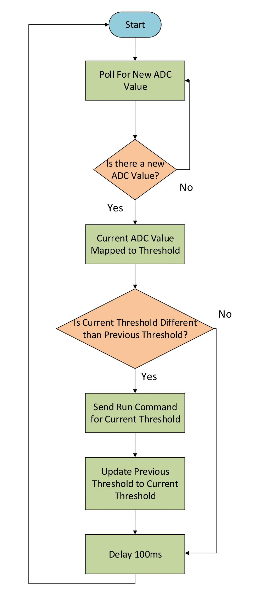

# TwoAxisMotorControlProject

This repository is forked from the UWaterloo MTE325 lab repo and developed by Daniel Luchian, Jarryd Ross, and Robson Lamond. It contains the firmware for a two-axis motor control system, developed for a lab/course project for [MTE325-Microprocessor Systems and Interfacing](https://uwflow.com/course/mte325).

## Table of Contents

- [Firmware Overview](#overview)
  - [Project Goal](#project-goal)
  - [Design Breakdown](#design-breakdown)
- [Project Hardware and Tools](#roject-hardware-and-tools)
  - [Hardware Used](#hardware)
  - [Pinout](#pinout)
  - [Development Environment](#development-environment)
  - [Libraries and Frameworks](#libraries-and-frameworks)
- [Additional Notes](#additional-notes)
  - [Uart Driver File Swap](#uart-driver-file-swap)
  - [Authors and Acknowledgment](#authors-and-acknowledgment) 
 
## Firmware Overview

### Project Goal

### Design Breakdown

## Project Hardware and Tools

### Hardware Used

### Pinout

### Development Environment

### Libraries and Frameworks

## Additional Notes

### Uart Driver file Swap
A hal driver file needs to be swapped to get the UART working. The stm32f4xx_hal_uart.c file in this repo will need to replace the file of the same name in your platformIO stm32 framework packages. The install location should be something similar to C:\...\.platformio\packages\framework-stm32cubef4\drivers\STM32F4xx_HAL_Driver\Src

### Authors and Acknowledgments
The source code for this project was adapted from the Microsteping Motor example for the Nucleo F401RE board provided by STM.
